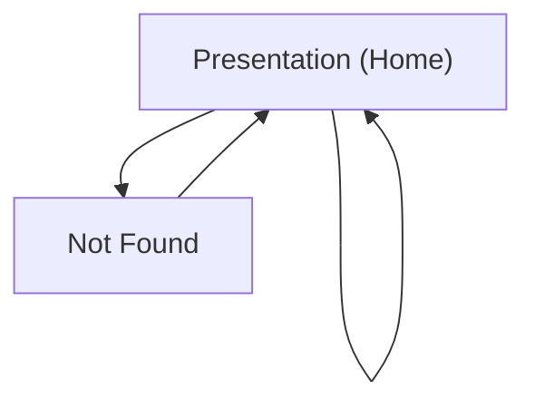

## 1. Product Overview
A single-page animated presentation website that renders a fullscreen, slide-like experience.
Slides must be loaded from `/research/documents` and slide-specific images from `/research-images/slide-X-imgs`, with smooth keyboard and scroll navigation.

## 2. Core Features

### 2.1 Feature Module
1. **Presentation (Home) Page**: slide loader from local content folders, fullscreen slide sections, animated transitions, keyboard/scroll navigation.
2. **Not Found Page**: minimal fallback for invalid routes.

### 2.3 Page Details
| Page Name | Module Name | Feature description |
|-----------|-------------|---------------------|
| Presentation (Home) | Content loading | Load ordered slide content from `/research/documents` at runtime/build-time and render as a sequence of slides. |
| Presentation (Home) | Image loading | Resolve and display images from `/research-images/slide-X-imgs` for the corresponding slide number `X`. |
| Presentation (Home) | Fullscreen slide layout | Render each slide as a viewport-filling section with consistent margins and readable typography. |
| Presentation (Home) | Navigation (keyboard) | Navigate slides using arrow keys / PageUp/PageDown / Space (next) and maintain an active slide index. |
| Presentation (Home) | Navigation (scroll/trackpad) | Convert scroll/trackpad input into discrete slide changes (debounced/throttled) while preserving native accessibility where possible. |
| Presentation (Home) | Animated transitions | Animate slide entry/exit and intra-slide element reveals to create a presentation feel. |
| Presentation (Home) | Loading & error states | Show loading indicator while resolving slide assets; show a clear error message when slide files/images can’t be loaded. |
| Not Found | Fallback routing | Display a minimal message and link back to the presentation home. |

## 3. Core Process
**Viewer Flow**
1. Open the website and the presentation initializes by loading slide documents from `/research/documents`.
2. The first slide renders fullscreen; associated images load from `/research-images/slide-1-imgs`.
3. You navigate forward/backward with keyboard keys or scroll gestures.
4. On each navigation step, the site transitions to the next/previous fullscreen section and updates the active slide.

