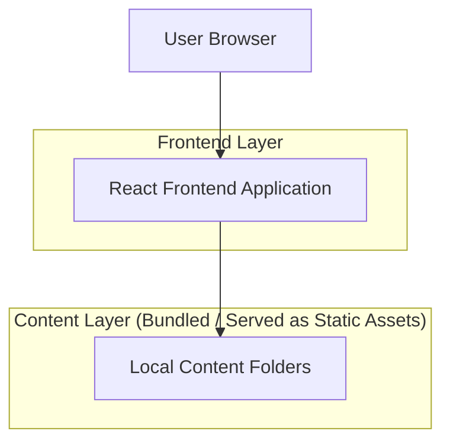

## 1.Architecture design

## 2.Technology Description
- Frontend: React@18 + TypeScript + vite
- Styling: tailwindcss@3 (or CSS Modules)
- Animation: framer-motion (for slide transitions)
- Backend: None

## 3.Route definitions
| Route | Purpose |
|-------|---------|
| / | Presentation home; loads slide documents and renders fullscreen slide sections |
| * | Not found fallback |

## 6.Data model(if applicable)
### 6.1 Data model definition
No database.

### Implementation notes (non-deployment)
- Slide loading: Use Vite `import.meta.glob` to load files from `/research/documents` into a deterministic ordered list (e.g., sorted by filename).
- Image loading: Use `import.meta.glob` to load all images under `/research-images/slide-*-imgs/*` and group them by slide number (`X`).
- Navigation: Maintain `activeSlideIndex` in client state; on keyboard/scroll events, compute next index and programmatically scroll to the corresponding section.
- Fullscreen sections: Use CSS `height: 100vh` and (optionally) `scroll-snap-type: y mandatory` with programmatic snapping as needed for consistent behavior across trackpads.
